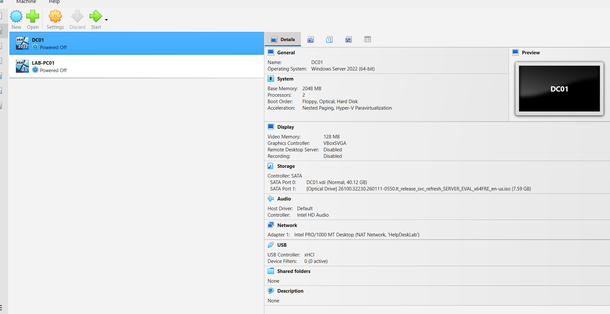
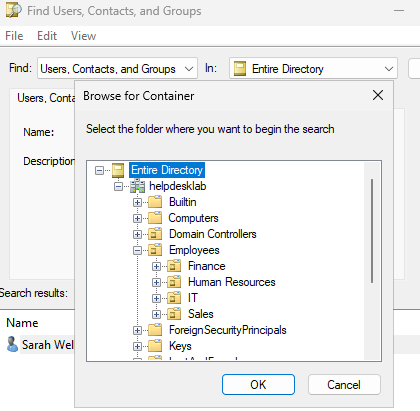
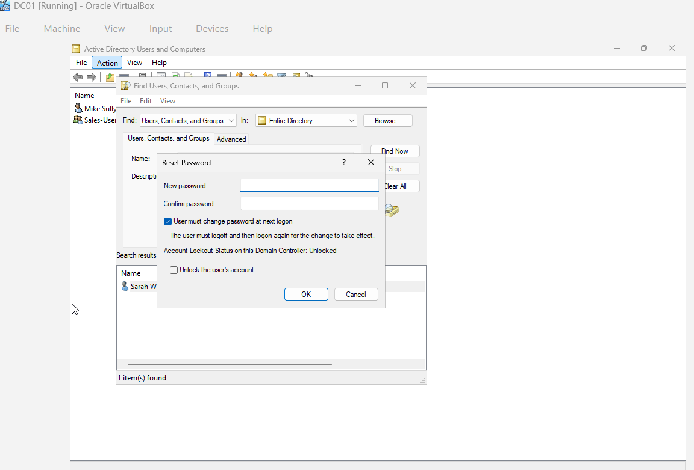
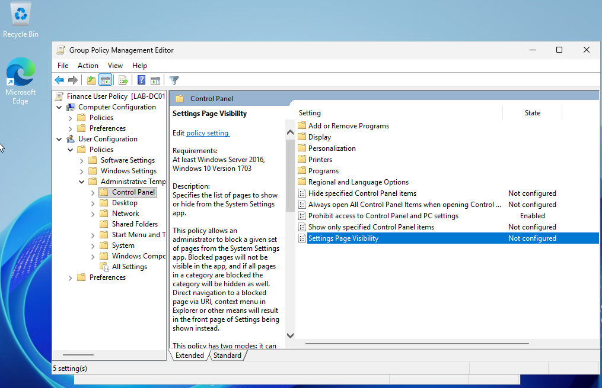
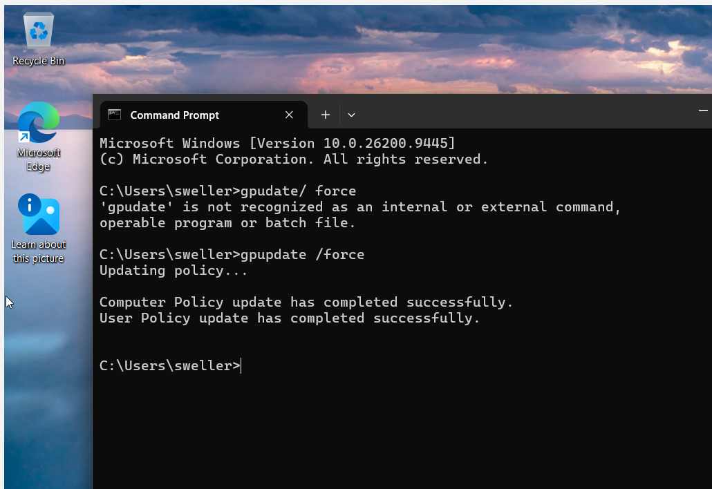
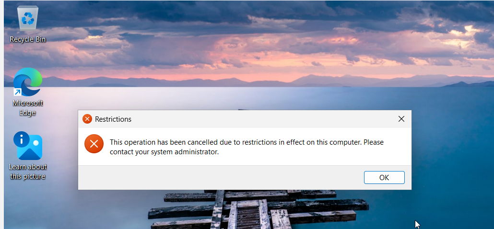

# Windows Server 2025 Active Directory & Group Policy Help Desk Home Lab

## Overview

This project documents a Windows Server and Active Directory home lab that I built using Oracle VirtualBox to gain hands-on experience with technologies commonly used in IT Support, Help Desk, and Desktop Support environments.

The lab consists of a Windows Server 2025 domain controller and a Windows 11 Pro client workstation. I configured Active Directory Domain Services (AD DS), DNS, organizational units, user accounts, security groups, TCP/IP networking, virtual networking, domain connectivity, and Group Policy.

I also configured and tested a Group Policy Object (GPO) on the Windows 11 client to practice centralized administration and policy enforcement in a Windows domain environment.

The purpose of this project is to develop practical experience with Windows system administration, Active Directory, Group Policy, networking, and troubleshooting.

---

## Technologies Used

- Oracle VirtualBox
- Windows Server 2025
- Windows 11 Pro
- Active Directory Domain Services (AD DS)
- Active Directory Users and Computers (ADUC)
- Group Policy Management
- Group Policy Objects (GPOs)
- DNS
- TCP/IP
- Windows Command Prompt
- Virtual Networking

---

## Lab Environment

The lab was created in Oracle VirtualBox using two virtual machines:

### DC01 - Windows Server 2025

DC01 functions as the domain controller for the lab.

The server was configured with:

- Active Directory Domain Services (AD DS)
- DNS
- Active Directory Users and Computers
- Group Policy Management
- Static TCP/IP configuration
- Domain services

The Active Directory domain used for the lab is:

`helpdesklab.local`

### LAB-PC01 - Windows 11 Pro

LAB-PC01 represents an employee workstation in the simulated business environment.

The workstation was configured to communicate with the domain controller through the VirtualBox lab network.

The Windows 11 client was also used to test domain connectivity and Group Policy enforcement.

---

## VirtualBox Network

I created a VirtualBox NAT Network named:

`HelpDeskLab`

The lab network uses the following subnet:

`10.10.10.0/24`

Both DC01 and LAB-PC01 were connected to the HelpDeskLab virtual network so that the server and client could communicate.

The Windows Server domain controller was configured with a static IP address, and the Windows 11 client was configured to use the domain controller for DNS.

During the configuration process, I practiced troubleshooting:

- IP addressing
- DNS configuration
- Virtual network adapters
- Client-to-server communication
- Windows network connectivity

---

## Active Directory Domain Services

I installed Active Directory Domain Services on Windows Server 2025 and configured the server as a domain controller.

The domain created for the lab was:

`helpdesklab.local`

Using Active Directory Users and Computers, I created an organizational structure designed to simulate a small business environment.

---

## Organizational Units

I created an `Employees` Organizational Unit (OU).

Inside the Employees OU, I created departmental OUs for:

- Finance
- Human Resources
- IT
- Sales

This allowed user accounts and policies to be organized by department.

---

## User Accounts

I created test domain user accounts for different departments.

These accounts were used to practice:

- Creating Active Directory users
- Organizing users into departmental OUs
- Managing user accounts
- Testing domain authentication
- Applying administrative changes
- Testing Group Policy

The accounts contain fictional information and are used only inside the isolated home lab environment.

---

## Security Groups

I created departmental security groups to practice managing users through group membership.

Groups included:

- Finance
- Human Resources
- IT
- Sales

Users were assigned to their appropriate departmental groups.

This provided hands-on practice with:

- Creating security groups
- Adding users to groups
- Managing group membership
- Organizing Active Directory resources

---

## Windows 11 Domain Client

I installed Windows 11 Pro on LAB-PC01 to simulate an employee workstation.

The workstation was configured to communicate with the Windows Server domain controller through the HelpDeskLab virtual network.

DNS on the Windows 11 client was configured to use the domain controller.

I tested communication between the Windows 11 workstation and Windows Server using Windows networking tools such as:

`ping`

The Windows 11 workstation was joined to the Active Directory domain so that domain users and domain policies could be tested from a client computer.

---

## Group Policy Configuration

I used Group Policy Management to practice centralized administration of Windows domain users.

A Group Policy was configured for the Finance department.

One of the policies I configured was:

**Prohibit access to Control Panel and PC settings**

The policy was enabled so that affected users would be prevented from accessing restricted Windows settings.

This simulated an administrative policy that an organization could use to prevent employees from changing certain workstation configurations.

---

## Applying Group Policy

After configuring the Group Policy, I logged into the Windows 11 domain workstation and manually refreshed Group Policy using:

`gpupdate /force`

The client successfully reported:

`Computer Policy update has completed successfully.`

`User Policy update has completed successfully.`

This confirmed that the workstation was able to communicate with the domain environment and retrieve updated Group Policy settings.

---

## Verifying Group Policy Enforcement

After updating Group Policy, I tested the configured restriction from the Windows 11 client.

When the affected domain user attempted to access the restricted Windows settings, Windows displayed:

`This operation has been cancelled due to restrictions in effect on this computer. Please contact your system administrator.`

This verified that the Group Policy was successfully applied and enforced on the domain workstation.

The process provided hands-on experience with:

- Creating Group Policy Objects
- Configuring administrative policies
- Applying policies to domain users
- Updating Group Policy on a client
- Testing policy enforcement
- Troubleshooting Group Policy
- Verifying administrative changes

---

## Help Desk Administration Practice

The lab was also used to practice common entry-level IT administration tasks.

Examples included:

- Creating user accounts
- Organizing users into OUs
- Creating security groups
- Managing group membership
- Configuring client DNS
- Testing network connectivity
- Applying Group Policy
- Verifying workstation restrictions
- Troubleshooting domain communication

These exercises were designed to simulate tasks that may be encountered in Help Desk, Desktop Support, and Windows administration environments.

---

## Troubleshooting Experience

Building the environment required troubleshooting several configuration issues.

Examples included:

- Correcting VirtualBox network adapter settings
- Configuring static TCP/IP settings
- Configuring the Windows client to use the domain controller for DNS
- Testing connectivity between the client and domain controller
- Troubleshooting TCP/IP communication
- Refreshing Group Policy from the Windows client
- Testing whether Group Policy restrictions were successfully applied

Instead of only configuring the environment, I tested changes from the client side to verify that they worked as expected.

---

## Skills Practiced

Through this project, I gained hands-on experience with:

- Windows Server 2025
- Windows 11 Pro
- Oracle VirtualBox
- Active Directory Domain Services
- Active Directory Users and Computers
- Domain controller configuration
- DNS
- TCP/IP networking
- Organizational Units
- Active Directory user administration
- Security groups
- Group membership
- Windows domain environments
- Domain-joined workstations
- Group Policy Management
- Group Policy Objects
- `gpupdate /force`
- Group Policy testing and verification
- Virtual networking
- Client/server connectivity
- Windows troubleshooting

---

## Screenshots

The following screenshots document different stages of the lab.

### VirtualBox Lab Environment

This screenshot shows the virtualized lab environment containing the Windows Server domain controller and Windows 11 client connected to the HelpDeskLab network.

### Active Directory Organizational Structure

This screenshot shows the Active Directory domain and departmental Organizational Units created under the Employees OU.

### Active Directory Password Reset

I practiced resetting a domain user's password in Active Directory Users and Computers (ADUC), including requiring the user to change the password at the next logon.

### Group Policy Configuration

This screenshot shows the Finance User Policy configured through Group Policy Management.

The policy **Prohibit access to Control Panel and PC settings** is enabled.

### Group Policy Update

After configuring the policy, I used `gpupdate /force` on the Windows 11 client to retrieve the updated policies.

### Group Policy Verification

The Windows 11 client displays a restriction message when the domain user attempts to access the restricted settings, confirming that the policy was successfully enforced.

---

## What I Learned

This project helped me better understand how Windows computers are centrally managed in a domain environment.

I gained practical experience with the relationship between:

- Active Directory users and groups
- Organizational Units
- DNS
- Domain controllers
- Domain-joined Windows workstations
- Group Policy
- Windows networking

The project also reinforced the importance of testing configurations from the end-user workstation instead of assuming that a server-side change was successfully applied.

---

## Future Improvements

I plan to continue expanding the lab with additional Help Desk and Windows administration scenarios, including:

- Shared network folders
- NTFS permissions
- Department-based file access
- DHCP
- PowerShell administration
- Account lockout troubleshooting

- Windows Event Viewer troubleshooting
- Remote administration
- Help Desk ticket simulations

As new features are configured and tested, they will be documented in this repository.

---

## Project Purpose

I built this home lab to strengthen my practical knowledge of Windows Server, Active Directory, Group Policy, networking, and IT troubleshooting.

The environment provides a safe place to practice Windows administration and simulate common tasks found in entry-level IT Support, Help Desk, and Desktop Support positions.
